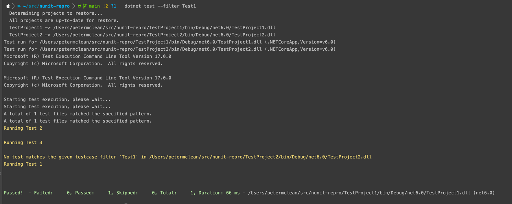

# Nunit filter repro

The purpose of this repository is to reproduce a potential issue with either the Nunit enigine of the NUnit3TestAdapter.

The issue attempted to demonstrate can be reproduced by running the following command...

```
dotnet test --filter Test1
```

The expected behaviour is that only Test1 is run, but both Test1, Test2 and Test3 appear to be run. This can be confirmed by looking at the content in the TestLog.txt file. Also, previously the console output was only shown for failing tests but now appears for all tests....


Tested on MacBook ARM processor with dotnet version 6.0.101